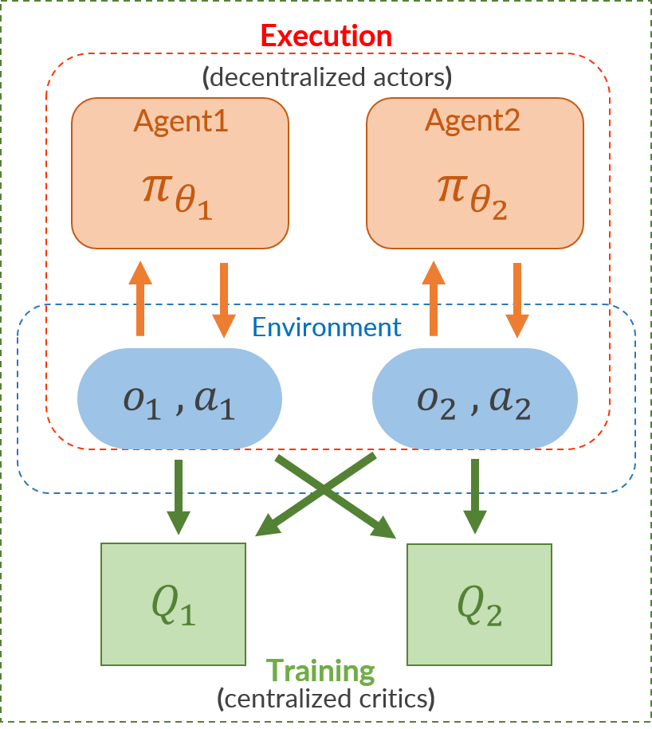
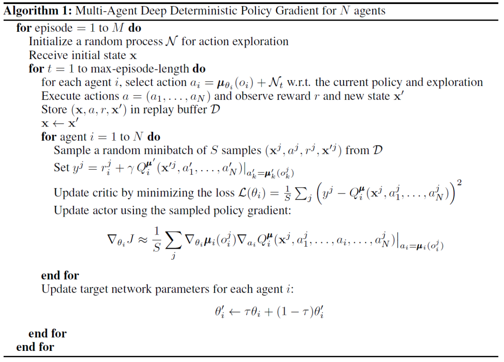
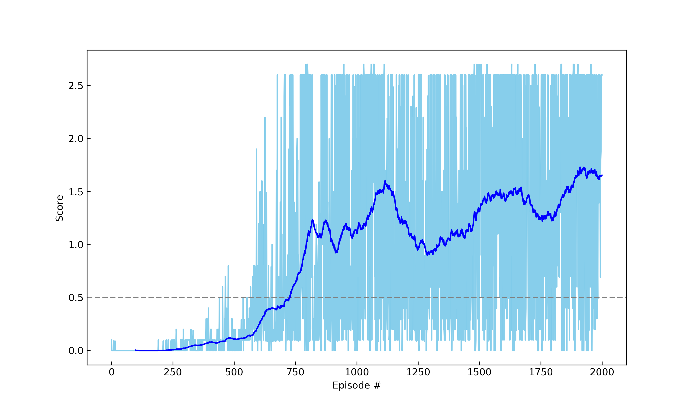
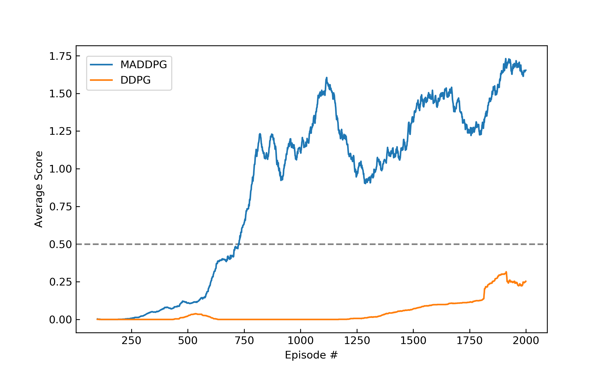

[//]: # (Image References)

[image1]: media/Tennis_Random.gif "Random Agents"
[image2]: media/Tennis_early.gif "Trained Agents 1"
[image3]: media/Tennis_late.gif "Trained Agents 2"

# Report : Collaboration in Tennis Environment

In this project, you will focus on **partially observable Markov games** and implement **Multi-Agent Deep Deterministic Policy Gradient (MADDPG)** then compare with the performance of single DDPG algorithm.

## Background

Partially observable Markov games is defined as follows.

-  : Number of agents
-  : Set of states 
-  : Set of actions for each agent
-  : Set of observations for each agent
-  : Stochastic policy for each agent
-  : State transition function that gives next state following the above policy
-  : Reward given to each agent
-  : Initial state  distribution
- The aim for each agent is to maximize its own total expected return with respect to 

The simplest approach to learning in multi-agent settings is to use independently learning agents. Such approach is however known to be impractical. The main issue lies in the notion of **non-stationarity environment**. In the traditional RL algorithm such as Q-learning and policy gradient, each agent uses only their own observations and each policy is changing during their training phase, this lets the environment become different from the perspective of any individual agent (violation of Markov assumptions for convergence). 
Such non-stationary environment is an obstacle for the straightforward use of **Experience Replay**, which is crucial for stabilizing deep Q-learning.

## Learning Algorithm

Multi-Agent Deep Deterministic Policy Gradient (MADDPG) algorithm is literally based on the [DDPG][ref2] algorithm ([see more details](https://github.com/4kasha/ContinuousControl_DDPG/blob/master/REPORT.md)).
To resolve the problem of non-stationarity mentioned above, the MADDPG algorithm adopts the framework of centralized training with decentralized execution (see the below fig).

At the centralized training phase, the critics for evaluating the each agent policy use not only local information but observations and actions from other agents through the reply buffer.
However these extra information from other agents is not given at the execution phase. 
In other words, each agent makes their decision via only their own observations.
This is the one of extension of ordinary actor-critic policy gradient methods where the critic is augmented with extra information about the policies of other agents.

Additionally such multiple critics allow each agent to have the different reward functions.
As is mentioned in the [original paper][ref3], this framework can be applied not only to cooperative interaction but to competitive or mixed interaction involving both physical and communicative behavior. 
In summary, the pseudocode for MADDPG algorithm is as follows.

## Code structure

- `./train.py` : code for training the multiple agents in Tennis env. via MADDPG
- `./maddpg/agents.py` : main code for the MADDPG algorithm
- `./maddpg/ddpg.py` : code for the single agent following the DDPG algorithm
- `./maddpg/model.py` : network details for actor and critic
- `./maddpg/noise.py` : code for producing noise
- `./maddpg/utils.py` : replay buffer code for MADDPG and soft update function

## Hyperparameters

The following hyperparameters specify the learning structure.

|name|value|description|
|:--:|:--:|:--:|
|BUFFER_SIZE|1e6|replay buffer size|
|BATCH_SIZE|256|minibatch size|
|GAMMA|0.99|discount factor|
|TAU|1e-3|for soft update of target parameters|
|LR_ACTOR|1e-3|learning rate of the actor|
|LR_CRITIC|1e-3|learning rate of the critic|
|WEIGHT_DECAY|0|L2 weight decay|
|UPDATE_EVERY|1|how often to update the target network|
|THETA|0.15|parameter for Ornstein-Uhlenbeck process|
|SIGMA|0.2|parameter for Ornstein-Uhlenbeck process and Gaussian noise|

## Parameters for training
- n_episodes (=**2000**) : maximum number of training episodes
- eps_start (=**1.0**) : starting value of epsilon, for exploration action space
- eps_end (=**0.01**) : minimum value of epsilon
- eps_decay (=**0.9999**) : multiplicative factor (per episode) for decreasing epsilon
- goal_score (=**0.5**) : average score to be required
- noise (=**gauss**): noise type for action, gauss (Gaussian) or OU (Ornstein-Uhlenbeck process)

## Network Structure

The network for each agent consists of Actor and Critic network and the corresponding parameters are as follow.

- hidden_layers (list): size of hidden_layers
- use_bn (=**True**): use batch normalization or not
- use_reset (=**True**): weights and bias initialization used in the [ddpg paper][ref2] to ensure the initial outputs for the policy and value estimates are near zero.

1. Actor
    - 2 hidden layers with 256 and 128 nodes respectively.
    - Batch normalization at each layer.
    - Relu activation function after the Batch normalization.
    - Tanh() at the output layer to ensure the action takes the value in [-1,1]

2. Critic
    - 2 hidden layers with 256 and 128 nodes respectively.
    - Batch normalization only at iput and the first hidden layer.
    - Actions are inserted at the second hidden layer as same with the [ddpg paper][ref2].
    - Relu activation function for each layer.

## Plot of Rewards

A reward of **+0.1** is provided for the agent who hits the ball over the net. On the other hand, A reward of **-0.01** is provided for the agent whose ball hits the ground or out of bounds. 

Under the following definition of a **single score**, 

- After each episode, we add up the rewards that each agent received (without discounting), to get a score for each agent. This yields 2 (potentially different) scores. We then take the maximum of these 2 scores.
- This yields a **single score** for each episode.

the environment is considered solved, when the average (over 100 episodes) of those **scores** is at least +0.5.

The results of rewards are illustrated in the below figure with the average score (over 100 episodes). After achieving the goal score, the average score gradually increases while oscillating and reaches around **+1.6**.
The number of episodes needed to solve this environment is **626 episodes** (see. [MARL_Results.ipynb](MARL_Results.ipynb)). Additionally, the performance of single DDPG algorithm is compared with that of MADDPG in this environment under the condition of same model structure and hyperparameter settings. (this can be reproduced by `scores_ddpg.txt` in `scores` folder). 
In the case of DDPG each agent used only local information and trained the same actor network for their actions, and the experience was added to a shared replay buffer. 
This result is consistent with the [original paper][ref3]. 

The following videos are a behaviour of random agents (top) and trained agents (bottom) with MADDPG respectively.

![Random Agents][image1]

The left one is just after achieving the goal score (0.5) and the right one is the late stage of learning around 2000 episodes. (the same things can be reproduced with saved weights in the folder `weights` and [MARL_Watch_Agent.ipynb](MARL_Watch_Agent.ipynb).)

![Trained Agents 1][image2]
![Trained Agents 2][image3]

## Ideas for Future Work

### Interested in the following algorithm and topics

- [Mean Field Multi-Agent Reinforcement Learning](https://arxiv.org/pdf/1802.05438.pdf)
- [OpenAI Five](https://blog.openai.com/openai-five/)
- [Curiosity-driven Exploration by Self-supervised Prediction](https://pathak22.github.io/noreward-rl/)

## Reference

- [D. Silver, et al. "Deterministic Policy Gradient Algorithms"][ref1], ["Supplementary Material"][ref1-2] 
- [T. P. Lillicrap, et al. "CONTINUOUS CONTROL WITH DEEP REINFORCEMENT LEARNING"][ref2]
- [R. Lowe, et al. "Multi-agent actor-critic for mixed cooperative-competitive environments"][ref3]
- [OpenAI : Multi-Agent Deep Deterministic Policy Gradient (MADDPG)][ref4] 

[ref1]: http://proceedings.mlr.press/v32/silver14.pdf
[ref1-2]:http://proceedings.mlr.press/v32/silver14-supp.pdf
[ref2]: https://arxiv.org/abs/1509.02971
[ref3]: https://arxiv.org/abs/1706.02275
[ref4]: https://github.com/openai/maddpg